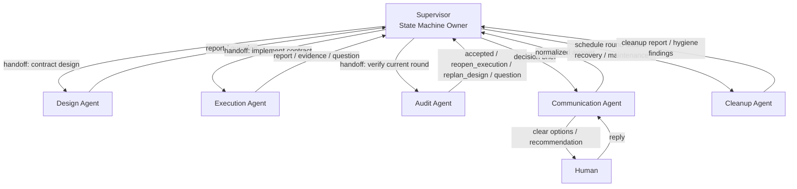

# Harness Architecture

> 文档类型：架构设计  
> 状态：2026-03-26 目标架构基线  
> 适用范围：`harness-engineering/`

## 1. 文档目的

这份文档定义 `Harness Engineering` 的目标协作架构。

它描述的是下一步应该实现成什么，而不是把当前代码里的过渡写法直接当成最终形态。

当前代码仍保留一部分固定流水线特征。
本文件是后续重构应遵守的设计真相。

## 2. 核心架构决策

### 2.1 Supervisor 是唯一调度者

`supervisor` 是整个 runtime 的唯一调度中心。

它负责：

- 选择下一位应该运行的 agent
- 决定当前 round 的状态迁移
- 处理普通 blocker
- 决定是否需要人类介入
- 调度 `cleanup-agent` 的短周期与长周期运行

它不把这些决定下放给其他 agent。

### 2.2 主链不是固定流水线

目标主链不是：

- `communication -> design -> execution -> audit -> cleanup`

目标主链是一个由 `supervisor` 驱动的状态机：

- `design-agent`
- `execution-agent`
- `audit-agent`

这三个角色构成工作回环。

`audit-agent` 可以：

- 接受当前 round
- 退回 `execution-agent`
- 退回 `design-agent`

### 2.3 Communication Agent 是侧通道

`communication-agent` 不属于主工作回环。

它是唯一的人类入口和出口，但它只在 `supervisor` 决定需要时才被唤起。

其他 agent 不能直接调用它。
其他 agent 遇到问题只能向 `supervisor` 提问。

### 2.4 Cleanup Agent 有三种节奏

`cleanup-agent` 不是每次固定排在主链最后的一步。

它有三种运行模式：

- `round-close`
  - 在一个 round 被接受后做短周期收口
- `recovery`
  - 在重启、中断、锁冲突、孤儿状态出现时做恢复性清理
- `maintenance`
  - 每隔一段时间执行一次长周期维护，例如每几小时做一次代码与运行时卫生检查

### 2.5 人类介入只能由 Supervisor 决定

是否需要人类参与，不由 `design-agent`、`execution-agent`、`audit-agent`、`cleanup-agent`、`communication-agent` 自行判断。

唯一合法路径是：

1. agent 写 question 给 `supervisor`
2. `supervisor` 判断是否能自动处理
3. `supervisor` 如果认定这是 decision gate，才创建给 `communication-agent` 的 communication brief

## 3. 角色与职责

### 3.1 Supervisor

Owner:

- runtime 调度真相
- round 状态真相
- gate policy 真相

Responsibilities:

- 读取 `mission`、`state`、`handoff`、`report`、`question`、`answer`
- 决定当前 active agent
- 为 agent 生成 handoff
- 消化普通 blocker
- 决定是否打开人类 decision gate
- 安排 `cleanup-agent` 的三种模式
- 决定 round 结束、下一 round 开始、或整个任务结束

### 3.2 Design Agent

Owner:

- 当前 round 的 contract

Responsibilities:

- 把当前目标收敛成可执行切片
- 明确边界、写入范围、验收条件
- 发现 contract 不足时向 `supervisor` 提问

### 3.3 Execution Agent

Owner:

- 当前 contract 的实现与验证执行

Responsibilities:

- 按当前 contract 实施工作
- 运行验证
- 产出实现证据
- 在实现过程中把 blocker 交给 `supervisor`

### 3.4 Audit Agent

Owner:

- 当前 round 的验收 verdict

Responsibilities:

- 检查实现结果
- 检查验证证据
- 明确写出 `accepted`、`reopen_execution`、`replan_design`
- 不因为 agent 会话结束就默认任务完成

### 3.5 Cleanup Agent

Owner:

- 运行时卫生与可恢复性

Responsibilities:

- `round-close`
  - 压缩当前 round 的状态
  - 清理无效 runtime debris
  - 刷新恢复点
- `recovery`
  - 修复中断后的 runtime 不一致
  - 处理孤儿 handoff / report / lock
- `maintenance`
  - 定期发现垃圾代码、死文件、临时产物、陈旧上下文
  - 对纯 runtime debris 可直接处理
  - 对涉及 repo 代码删除或破坏性修改的事项，必须回到 `supervisor` 决策，再走正常执行和验收链

### 3.6 Communication Agent

Owner:

- 人类沟通表面

Responsibilities:

- 把 `supervisor` 的 decision brief 转成人类容易理解的表达
- 清楚说明背景、选项、代价、建议、需要回复的内容
- 汇总相关 agent 的观点，但不替代 `supervisor` 做调度判断
- 接收人类回复并规范化写回 runtime

Boundaries:

- 不能自行决定何时打扰人类
- 不能绕过 `supervisor` 直接给其他 agent 下指令
- 不能把模糊的人类回复直接变成新的任务切片而不经过 `supervisor`

## 4. 协作约束

必须成立的关系：

- agent 之间不直接互相调度
- agent 不直接互相要求人类答复
- agent 不直接调用 `communication-agent`
- 所有 question 先交给 `supervisor`
- 所有是否升级为 human gate 的判断都由 `supervisor` 做
- 所有面向人的表达都由 `communication-agent` 做

## 5. Communication Brief

`communication-agent` 不应该只把原始 question 原封不动转给人。

`supervisor` 提供给它的应该是一个结构化 brief，至少包括：

- `decision_id`
- `question`
- `why_not_auto_answered`
- `current_context`
- `options`
- `tradeoffs`
- `supervisor_recommendation`
- `agent_positions`
- `required_reply_shape`

这样人类看到的不是零散 agent 想法，而是一个可做决策的说明面。

## 6. 三条运行通道

### 6.1 Work Lane

主工作回环是：

1. `supervisor` 选择当前 round 的工作入口
2. `design-agent` 产出或修正 contract
3. `execution-agent` 实施并留下验证证据
4. `audit-agent` 产出 verdict
5. `supervisor` 根据 verdict 决定：
   - 回到 `execution-agent`
   - 回到 `design-agent`
   - 结束当前 round

### 6.2 Human Lane

人工侧通道是：

1. 任一 specialist agent 写 question 给 `supervisor`
2. `supervisor` 判断这是否是普通 blocker
3. 若不是普通 blocker，`supervisor` 创建 communication brief
4. `communication-agent` 面向人类表达问题和选项
5. 人类回复给 `communication-agent`
6. `communication-agent` 把回复规范化写回 runtime
7. `supervisor` 把回复路由回被阻塞的 agent 或 mission

### 6.3 Cleanup Lane

清理侧通道是：

1. `supervisor` 根据 round 完结、恢复需要、或维护计时器决定是否调用 `cleanup-agent`
2. `cleanup-agent` 在对应模式下工作
3. `cleanup-agent` 返回 cleanup report
4. `supervisor` 决定：
   - 继续主工作回环
   - 启动维护切片
   - 打开 decision gate

## 7. 状态迁移

目标状态迁移至少包括：

- `new_mission -> design`
- `design_done -> execution`
- `execution_done -> audit`
- `audit_reopen_execution -> execution`
- `audit_replan_design -> design`
- `ordinary_question_answered -> same_agent`
- `decision_gate_opened -> waiting_human`
- `human_reply_received -> blocked_agent`
- `round_accepted -> cleanup_round_close`
- `recovery_needed -> cleanup_recovery`
- `maintenance_due -> cleanup_maintenance`
- `cleanup_done -> supervisor_dispatch`
- `mission_finished -> completed`

## 8. 图

## 9. 当前代码偏差

截至 2026-03-26，当前代码仍有这些偏差：

- `lib/scheduler.py` 仍包含较多内嵌角色逻辑
- `RunnerBridge` 仍保留一个低层 fixed-chain utility，但主入口和暴露给人的 `/run` 已不再依赖它表达主调度真相
- `cleanup-agent` 的 `maintenance` 已实现为 mission 内长周期调度，但还不是独立常驻后台服务
- `cleanup-agent` 目前更偏 runtime hygiene 和候选卫生发现，还没有形成强验收级别的代码清理闭环

因此：

- 本文描述的是批准后的目标架构
- 不是对当前代码现状的夸大表述

## 10. 实施要求

后续实现必须遵守：

- 先把 `supervisor` 改成状态机，再拆角色逻辑
- 不把 `communication-agent` 放回主链第一步
- 不让 specialist agent 直接触达人类
- 不把 `cleanup-agent` 缩回“每轮固定最后一步”
- 不把普通 blocker 伪装成 decision gate
